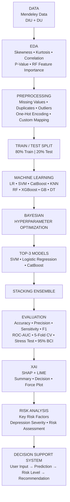

# Depression-Documentary

---

##  Workflow




---

#  Pseudocode

## 1. Dataset

```python
INPUT:
    D = Mendeley Dataset
    D = {DIU, DU}

OUTPUT:
    Raw Dataset D
```

---

## 2. Exploratory Data Analysis

```python
for feature x in D:

    skewness(x)
    kurtosis(x)

for (x_i, x_j) in D:
    correlation(x_i, x_j)
    p_value(x_i, x_j)

RF = RandomForest(D)

importance = RF.feature_importance()
```

---

## 3. Data Preprocessing

```python
D ← handle_missing_values(D)

D ← remove_duplicates(D)

D ← manage_outliers(D)

D ← one_hot_encode(D)

D ← custom_mapping_encode(D)
```

---

## 4. Train-Test Split

```python
D_train, D_test = train_test_split(
    D,
    test_size = 0.20,
    train_size = 0.80
)
```

```text
D_train → 80%
D_test  → 20%
```

---

## 5. Machine Learning

```python
M = {

    LogisticRegression(),
    SVM(),
    CatBoost(),
    KNN(),
    RandomForest(),
    XGBoost(),
    GradientBoosting(),
    DecisionTree()

}

for model in M:

    model.fit(
        X_train,
        y_train
    )

    y_pred = model.predict(X_test)

    evaluate(
        y_test,
        y_pred
    )
```

---

## 6. Bayesian Hyperparameter Optimization

```python
for model in M:

    θ* = BayesianOptimization(
        objective = CV_Score,
        search_space = Θ
    )

    model_best = model(
        hyperparameters = θ*
    )
```

$$
\theta^* =
\arg\max_{\theta \in \Theta}
CV(\theta)
$$

---

## 7. Top-3 Model Selection

```python
Ranking = sort(
    models,
    key = performance,
    descending = True
)

Top3 = Ranking[:3]
```

```text
Top-3:

1. SVM
2. Logistic Regression
3. CatBoost
```

---

## 8. Stacking Ensemble

```python
BaseModels = {

    SVM,
    LogisticRegression,
    CatBoost

}

for model in BaseModels:

    z_i = model.predict_proba(X)

Z = [z_SVM,
     z_LR,
     z_CatBoost]

FinalModel = StackingClassifier(
    estimators = BaseModels
)

FinalModel.fit(
    X_train,
    y_train
)

ŷ = FinalModel.predict(X_test)
```


---

#  Evaluation

## Classification Metrics

```python
Accuracy    = correct / total

Precision   = TP / (TP + FP)

Sensitivity = TP / (TP + FN)

F1          = 2 * (Precision * Sensitivity) \
              / (Precision + Sensitivity)
```

---

## Stratified Cross-Validation with Five Folds

```python
CV = StratifiedKFold(
    n_splits = 5,
    shuffle = True
)

for train_idx, val_idx in CV:

    X_tr = X[train_idx]
    X_val = X[val_idx]

    y_tr = y[train_idx]
    y_val = y[val_idx]

    model.fit(X_tr, y_tr)

    score = evaluate(
        y_val,
        model.predict(X_val)
    )
```


---

## ROC-AUC

```python
y_prob = model.predict_proba(X_test)

ROC = ROC_Curve(
    y_test,
    y_prob
)

AUC = Area(ROC)
```

---

## Stress Test

```python
for ratio in {

    20/80,
    30/70,
    40/60,
    50/50,
    60/40,
    70/30,
    80/20,
    90/10

}:

    train_model(ratio)

    performance(ratio)
```

---

## 95% Bootstrap Confidence Interval

```python
for b in range(B):

    sample_b = bootstrap(D_test)

    score_b = metric(sample_b)

CI_95 = percentile(
    scores,
    [2.5, 97.5]
)
```


---

#  Explainable AI

## SHAP

```python
explainer = SHAP(model)

SHAP_values = explainer(X_test)
```

### SHAP Summary

```python
shap.summary_plot(
    SHAP_values,
    X_test
)
```

### SHAP Decision Plot

```python
shap.decision_plot(
    expected_value,
    SHAP_values,
    X_test
)
```

### SHAP Force Plot

```python
shap.force_plot(
    expected_value,
    SHAP_values[i],
    X_test.iloc[i]
)
```


---

## LIME

```python
lime_explainer = LimeExplainer(
    X_train
)

explanation = lime_explainer.explain(
    X_test[i],
    model.predict_proba
)
```

---

#  Depression Risk Analysis

## 1. Identification and analysis of key risk factors

```python
RiskFactors = rank(
    features,
    key = |SHAP_value|
)

TopRiskFactors = RiskFactors[:k]
```


---

## 2. Detection of depression severity  

```python
Input_X
    │
    ▼
Preprocessing
    │
    ▼
Stacking Model
    │
    ▼
P(Depression | X)
```


---

## 3. Risk Assessmen

```python
p = P(Depression | X)

if p < T_1:
    Risk = "Low"

elif p < T_2:
    Risk = "Moderate"

else:
    Risk = "High"
```


---

#  Explainable Decision Support System

```python
INPUT:
    User Data X

X_processed = preprocess(X)

prediction = FinalModel.predict(
    X_processed
)

probability = FinalModel.predict_proba(
    X_processed
)

risk = risk_stratification(
    probability
)

explanation = SHAP(
    X_processed
)

recommendation = generate_recommendation(
    risk,
    explanation
)

OUTPUT:
    ├── Depression Prediction
    ├── Probability
    ├── Risk Level
    ├── Key Risk Factors
    └── Recommendation
```

---

#  Complete Algorithm

```python
Algorithm Depression_Prediction():

    D ← load_mendeley_data()

    # EDA
    EDA(D)

    skewness(D)
    kurtosis(D)
    correlation(D)
    p_value(D)
    RF_importance(D)

    # Preprocessing
    D ← missing_value_handling(D)
    D ← duplicate_removal(D)
    D ← outlier_management(D)

    D ← one_hot_encoding(D)
    D ← custom_mapping_encoding(D)

    # Split
    Train, Test ← split(
        D,
        ratio = 80:20
    )

    # Base Models
    M ← {
        LR,
        SVM,
        CatBoost,
        KNN,
        RF,
        XGBoost,
        GB,
        DT
    }

    # Training
    for m ∈ M:

        m.fit(
            Train.X,
            Train.y
        )

    # Hyperparameter Optimization
    for m ∈ M:

        m* ← BayesianOptimization(m)

    # Model Ranking
    Top3 ← select_top3(M*)

    # Stacking
    Ensemble ← Stack(
        SVM,
        LR,
        CatBoost
    )

    Ensemble.fit(
        Train.X,
        Train.y
    )

    # Evaluation
    evaluate(
        Accuracy,
        Precision,
        Sensitivity,
        F1,
        ROC_AUC
    )

    Stratified_5Fold_CV()
    Stress_Test()
    BCI_95()

    # XAI
    SHAP(Ensemble)
    LIME(Ensemble)

    # Risk Analysis
    identify_risk_factors()
    predict_depression_risk()
    stratify_risk()

    # DSS
    build_DSS()

    return Prediction,
           Risk,
           RiskFactors,
           Explanation,
           Recommendation
```

---

#  Tools & Technologies

```text
Python
Jupyter Notebook
Pandas
NumPy
Scikit-learn
CatBoost
XGBoost
SHAP
LIME
Matplotlib
Seaborn
SciPy
```

---

#  Project Structure

```text
Depression-Prediction/
│
├── data/
│   └── dataset.csv
│
├── notebooks/
│   └── Depression_Prediction.ipynb
│
├── models/
│   └── trained_models/
│
├── xai/
│   ├── shap/
│   └── lime/
│
├── results/
│   ├── metrics/
│   ├── roc_auc/
│   ├── stress_test/
│   └── risk_analysis/
│
├── dss/
│   └── decision_support_system/
│
├── requirements.txt
│
└── README.md
```


